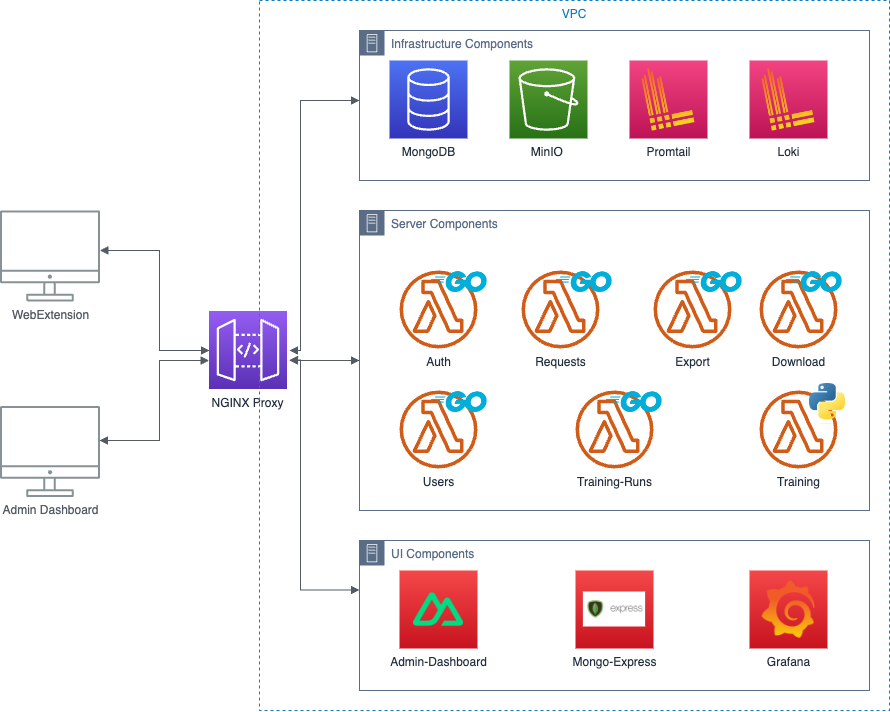

# tracking_detector_serverless

This application is the dockerized backend of the Tracking Detector WebExtension. Which can be used to
train models on the server and load them into the extension. Furthermore, it can store requests information
and perform exports on the data. With these exports new models can be trained. It also provides an admin dashboard
which can be used to look at logs the mongodb and provides features such as user management triggering exports and 
triggering training runs.

# Setup

In order to run this application docker must be installed with docker compose. Other than that nothing is required.
```sh
chmod +x wizard.sh
./wizard.sh # is used to configure the application and starts the docker compose
```

# Architecture

The architecture of this application is a microservice architecture which is depicted in the next figure.

